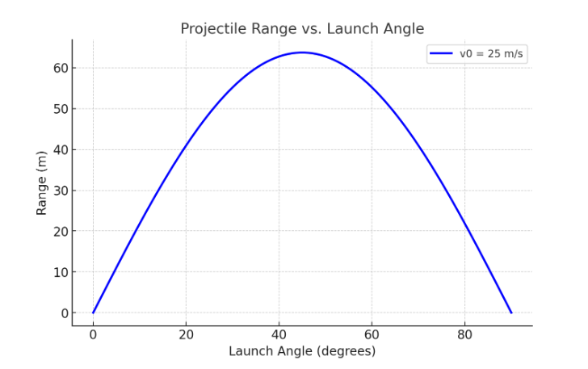

# Problem 1

Examination of the Range as a Function of the Launch Angle

## 1. Theoretical Basis

### Governing Equations of Motion

We begin by analyzing the motion of a projectile fired with an initial velocity $v_0$ at an angle $\theta$ relative to the horizontal. Assuming there is no air resistance and gravity $g$ acts downward, we can separate the motion into horizontal and vertical components.

#### Motion Equations:

- Horizontal motion:
  $$
  x(t) = v_0 \cos(\theta) t
  $$

- Vertical motion:
  $$
  y(t) = v_0 \sin(\theta) t - \frac{1}{2} g t^2
  $$

where:

- $x(t)$ and $y(t)$ represent the horizontal and vertical positions at time $t$, respectively.
- $v_0$ is the initial velocity,
- $\theta$ is the launch angle,
- $g$ is the acceleration due to gravity.

### Time of Flight and Range

To determine the total time of flight, we set $y(t) = 0$ and solve for $t$:

$$
0 = v_0 \sin(\theta) t - \frac{1}{2} g t^2
$$

Solving for $t$, we get two roots: $t = 0$ (the initial launch time) and $t = \frac{2 v_0 \sin(\theta)}{g}$. The latter represents the total time of flight, $t_f$:

$$
t_f = \frac{2 v_0 \sin(\theta)}{g}
$$

The horizontal range $R$ corresponds to the horizontal distance covered during this time, so we substitute $t_f$ into the equation for $x(t)$:

$$
R = v_0 \cos(\theta) t_f = v_0 \cos(\theta) \frac{2 v_0 \sin(\theta)}{g}
$$

Using the trigonometric identity $\sin(2\theta) = 2 \sin(\theta) \cos(\theta)$, we arrive at the range formula:

$$
R = \frac{v_0^2 \sin(2\theta)}{g}
$$

This expression reveals that the range is maximized when $\sin(2\theta) = 1$, which occurs when $2\theta = 90^\circ$, or $\theta = 45^\circ$.

---

## 2. Analysis of the Range

### Impact of Initial Conditions

- **Initial velocity ($v_0$)**: The range is directly proportional to the square of the initial velocity. Increasing $v_0$ significantly enhances the range.
- **Gravitational acceleration ($g$)**: The range is inversely proportional to the gravitational acceleration. A higher value of $g$ leads to a decrease in the range.
- **Launch angle ($\theta$)**: The range reaches its maximum at $\theta = 45^\circ$, and the relationship is symmetric around this angle.

### Graphical Representation

The following Python script demonstrates how the range varies with $\theta$:

```python
import numpy as np
import matplotlib.pyplot as plt

def range_function(theta, v0, g=9.81):
    return (v0**2 * np.sin(2 * np.radians(theta))) / g

# Parameters
v0 = 25  # initial velocity in m/s
theta = np.linspace(0, 90, 100)  # range of angles in degrees
g = 9.81  # gravity in m/s^2

# Compute ranges
ranges = range_function(theta, v0, g)

# Plot results
plt.figure(figsize=(8, 5))
plt.plot(theta, ranges, label=f'v0 = {v0} m/s')
plt.xlabel('Launch Angle (degrees)')
plt.ylabel('Range (m)')
plt.title('Projectile Range vs. Launch Angle')
plt.legend()
plt.grid(True)
plt.show()
```



---

## 3. Real-World Applications

- **Athletics**: The principles of projectile motion are valuable in optimizing release angles for sports such as archery, shot put, and football.
- **Technical Design**: These principles are applied in weaponry, defense technologies, and the design of flight trajectories for spacecraft and guided projectiles.
- **Cosmic Studies**: Projectile motion concepts are used to model the paths of celestial bodies and for planning interplanetary missions.

## 4. Implementation

A computational simulation can offer a deeper understanding of situations that involve air resistance. To include drag force, it is necessary to apply numerical solution methods (e.g., Runge-Kutta) for solving the corresponding differential equations.

### Example: Accounting for Air Resistance

The dynamic equations that account for drag $F_d = -k v^2$ are:

$$
m \frac{d^2 x}{dt^2} = -k v_x^2
$$

$$
m \frac{d^2 y}{dt^2} = -mg - k v_y^2
$$

A numerical computation tool, like Python's SciPy library, can be employed to solve these equations.

---


## 5. Limitations and Further Considerations

- **Atmospheric drag**: Leads to asymmetry in the trajectory and reduces the projectile's range.
- **Irregular terrain**: Requires solutions for more complex boundary conditions.
- **Wind effects**: Influences the trajectory in unpredictable ways.

Future research may explore the use of machine learning techniques to predict projectile paths in more complicated environments.

---

## Conclusion

The study of projectile motion provides valuable mathematical and physical insights. Although the simplified model is a good approximation, real-world applications require numerical methods to handle non-ideal conditions.
