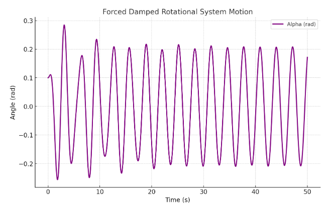

# Problem 2

Exploring the Dynamics of a Forced Damped Rotational System

## 1. Theoretical Basis

### Governing Equation
The motion of a forced damped rotational system is described by the nonlinear differential equation:

$$
I \frac{d^2\alpha}{dt^2} + c \frac{d\alpha}{dt} + k \sin\alpha = T_0 \cos(\Omega t)
$$

where:
- $\alpha$ represents the angular displacement,
- $c$ is the damping coefficient,
- $k$ is the restoring torque coefficient,
- $I$ is the moment of inertia,
- $T_0$ is the amplitude of the external driving torque,
- $\Omega$ is the driving frequency.

### Approximate Solutions for Small Rotations
For small angular displacements (\( \alpha \approx \sin \alpha \)), the equation simplifies to:

$$
I \frac{d^2\alpha}{dt^2} + c \frac{d\alpha}{dt} + k \alpha = T_0 \cos(\Omega t)
$$

This represents a damped, driven rotational harmonic oscillator, which can be solved using standard methods. The steady-state solution is given by:

$$
\alpha(t) = \alpha_0 e^{-ct/2I} + A_r \cos(\Omega t - \phi)
$$

where \( A_r \) and \( \phi \) depend on \( T_0, c, \Omega \), and other system parameters.

### Resonance Conditions
Resonance occurs when the driving frequency \( \Omega \) approaches the natural frequency \( \Omega_0 = \sqrt{k/I} \), resulting in large oscillations in rotational motion. At resonance, energy transfer is maximized, which has significant applications in mechanical design and rotational systems.


## 2. Analysis of Dynamics

### Impact of System Parameters

- **Damping Coefficient (\( c \))**: Higher damping reduces rotational motion and contributes to system stability.
- **Driving Torque Amplitude (\( T_0 \))**: Increased amplitudes can induce nonlinear dynamics and cause phase transitions.
- **Driving Frequency (\( \Omega \))**: Specific frequencies may lead to resonance or give rise to complex oscillatory behaviors.

### Transition to Nonlinear Behavior

By varying \( T_0 \) and \( \Omega \), the system can transition from simple rotational motion to more complex and unpredictable dynamics. These behaviors can be analyzed using:

- **Phase Space Plots**: Graphs of \( \alpha \) versus \( d\alpha/dt \) to explore system stability.
- **Discrete Mapping Analysis**: Time-sampled data to detect periodic or irregular behaviors.
- **Parameter Variation Diagrams**: Visual representations of how system behavior evolves as parameters are modified.

---


## 3. Real-World Applications

The forced damped rotational system model is applicable to various practical systems:
- **Rotational Energy Harvesters**: Used to optimize the conversion of kinetic energy into electrical power.
- **Structural Dynamics in Rotating Systems**: Helps in analyzing oscillations that might lead to mechanical failures.
- **Rotational Actuators**: Similar to controlled rotational devices that incorporate damping and external torque inputs.

---

## 4. Computational Simulation

Below is a Python script to model and visualize the behavior of the forced damped rotational system.


```python
import numpy as np
import matplotlib.pyplot as plt
from scipy.integrate import solve_ivp

def forced_damped_rotational(t, y, c, k, I, T0, Omega):
    alpha, alpha_dot = y
    dalpha_dt = alpha_dot
    dalpha_dot_dt = (-c * alpha_dot - k * np.sin(alpha) + T0 * np.cos(Omega * t)) / I
    return [dalpha_dt, dalpha_dot_dt]

# Parameters
c = 0.2    # damping coefficient
k = 9.81   # restoring torque coefficient
I = 1.0    # moment of inertia
T0 = 1.2   # driving torque amplitude
Omega = 2.0  # driving frequency
y0 = [0.1, 0]  # initial conditions: [alpha(0), alpha_dot(0)]
t_span = (0, 50)  # simulation time
t_eval = np.linspace(0, 50, 1000)  # time steps

# Solve ODE
sol = solve_ivp(forced_damped_rotational, t_span, y0, t_eval=t_eval, args=(c, k, I, T0, Omega))

# Plot results
plt.figure(figsize=(8, 5))
plt.plot(sol.t, sol.y[0], label='Alpha (rad)')
plt.xlabel('Time (s)')
plt.ylabel('Angle (rad)')
plt.title('Forced Damped Rotational System Motion')
plt.legend()
plt.grid()
plt.show()
```

This script numerically solves the rotational system equation and plots ( \alpha(t) ) over time.



---

## 5. Limitations and Extensions

- **Limitations**: The model assumes a point mass rotational system and neglects factors like friction and air resistance.
- **Extensions**:
    - Nonlinear damping (e.g., air drag proportional to the square of velocity).
    - Irregular driving torques to simulate non-periodic forcing.
    - Coupled rotational systems to study synchronization phenomena.

---

## 6. Conclusion

The forced damped rotational system displays a wide range of dynamic behaviors, from simple harmonic motion to chaotic oscillations. By adjusting parameters such as damping, driving force, and frequency, we can explore concepts like resonance, stability, and chaotic dynamics. This provides valuable insights into fundamental physics as well as practical engineering applications.
